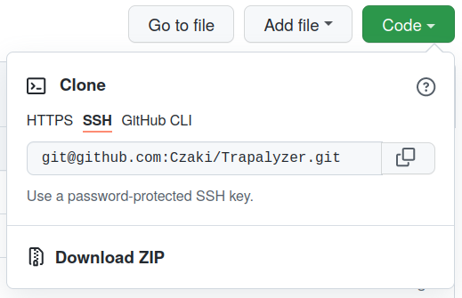

# Trapalyzer

Trapalyzer is a PartSeg plugin for automatic feature detection and
quantification for in-vitro NET release studies.

## Installation
Trapalyzer is a plug-in for the PartSeg image processing. To use Trapalyzer, you first need to [install PartSeg](https://github.com/4DNucleome/PartSeg). If you use Windows, you can simply download and unpack the `PartSeg.zip` file - no further installation needed. If you use Linux with a working Python distribution, we recommend installing PartSeg by running `pip install PartSeg[all]` in the command line.  

After you have installed PartSeg, you can install Trapalyzer:

- On Windows, download the ZIP file with the plug-in (see the screenshot below). Unpack the .zip archive and move the `Trapalyzer` directory (located in `Trapalyzer-master/src` in the unpacked archive) to the `plugins` directory in the PartSeg folder. 
- On Linux, we recommend installing via `pip install Trapalyzer`. 

## Usage examples 

In the Tutorial directory you will find instructions on how to use Trapalyzer to analyze an example data set of fluorescence microscopy images.  