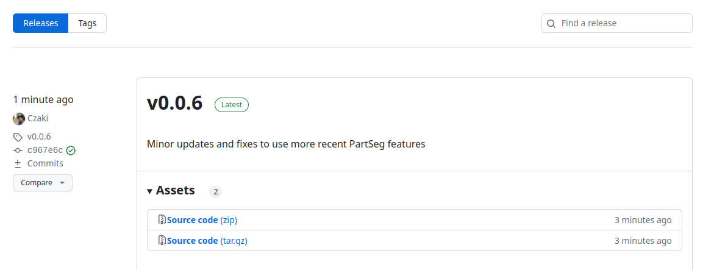

# Trapalyzer

Trapalyzer is a PartSeg and napari plugin for automatic feature detection and
quantification for in-vitro NET release studies.

## Installation

Trapalyzer is a plug-in for the PartSeg image processing. To use Trapalyzer,
you first need to [install PartSeg](https://github.com/4DNucleome/PartSeg).
If you use Windows, you can simply download and unpack the `PartSeg.zip` file -
no further installation needed. If you use Linux with a working Python
distribution, we recommend installing PartSeg by running
`pip install PartSeg[all]` in the command line.

After you have installed PartSeg, you can install Trapalyzer:

- If you install PArtSeg from prebuild binaries (from zip) then you need to download 
  this plugin from [release page](https://github.com/Czaki/Trapalyzer/releases) and unpack it to `plugins` directory in PartSeg folder.
- If you install PartSeg using pip or conda then you can install this plugin using pip
  `pip install Trapalyzer`

## Usage examples

In the Tutorial directory you will find instructions on how to use
Trapalyzer to analyze an example data set of fluorescence microscopy images.
