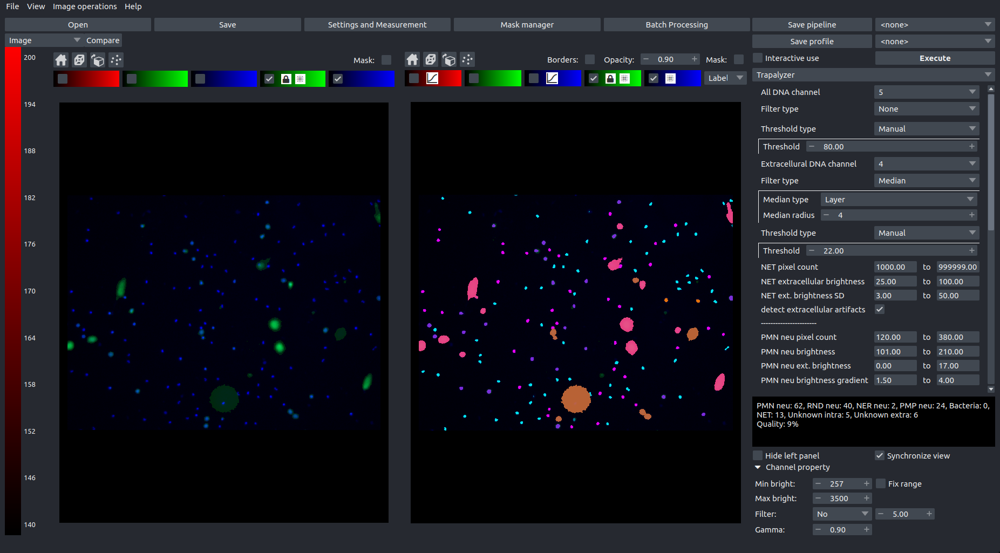

## Analyzing microscopic images with Trapalyzer
This tutorial describes how to analyze a data set of fluorescence microscopy images with Trapalyzer. It covers the process of tuning the software parameters and processing images in the batch mode. A sample data set used in this tutorial can be downloaded [here](https://github.com/krzysztoffiok/CNN-based-image-analysis-for-detection-and-quantification-of-neutrophil-extracellular-traps/blob/master/images/large_validation_set.zip). Download and unpack the .zip file from the link in your working directory. After unpacking, the data set used in this tutorial is located in the directory `large_validation_set/xml_pascal_voc_format/images/oryg`. 

## Installing Trapalyzer
Trapalyzer is a plug-in for the PartSeg image processing. To use Trapalyzer, [install PartSeg ](https://github.com/4DNucleome/PartSeg) first. 

## Interactive mode
Interactive session of PartSeg is used to analyze single images and to tune the parameters of Trapalyzer.  

Open PartSeg and select the "ROI Analysis" mode. Select "Trapalyzer" in the plug-in selection tab, highlighted below. Depending on the size of your screen, you may want to select the single-screen or the double-screen mode by clicking on *Hide left panel*. 

Next, select *View -> Toggle Multiple Files* and click on *Load files*, highlighted in the image below. Select first five images from the data set. PartSeg will display the list of the currently loaded files. Double-click on the *raw image* box under the first filename to display the image. 

You can now adjust the color channels to match the experiment (region 1. on the screenshot below). In our case, the images are stained with Hoechst 33342 and SYTOX Green, so we want to set two color channels: a blue one and a green one. The proper settings for these images are the following:  

  - Channel 1: Disabled,
  - Channel 2: Green (SYTOX Green stain),
  - Channel 3: Blue (Hoechst 33342 stain).  
  
Note that the number of active channels and their assigned colors may be different for your experiment. Assing the channels in the Trapalyzer window according to their corresponding stains (regions numbered 2. on the screenshot below).

Next, hover the cursor over some of the objects on the image. The two square brackets in region 3. on the screenshot below give you the information about location of the cursor (the first bracket) and the brightness values of all active channels (the second bracket; the two numbers correspond to channel 2 and channel 3, respectively). Hover the cursor over the edges of a NET and an unstimulated cell to check the proper values for brightness threshold that Trapalyzer will use to detect objects. The brightness threshold is the minimum brightness intensity that's considered to correspond to an object such as a cell, instead of the background. Set the brighntess thresholds for both channels in regions 4. on the screenshot below and click "Execute". Trapalyzer will highlight the detected objects. 

