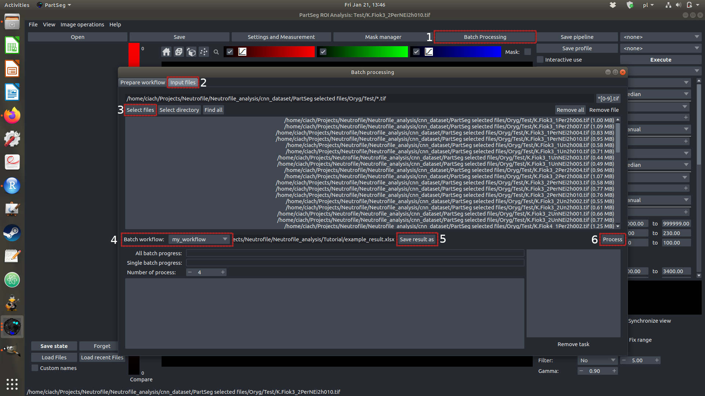

# Analyzing microscopic images with Trapalyzer

This tutorial describes how to analyze a data set of fluorescence microscopy
images with Trapalyzer. It covers the process of tuning the software parameters
and processing images in the interactive mode, importing and exporting the
parameters, and processing multiple images in the batch processing mode.

A sample data set used in this tutorial can be downloaded
[here](https://github.com/krzysztoffiok/CNN-based-image-analysis-for-detection-and-quantification-of-neutrophil-extracellular-traps/tree/master/images). Download and unpack the `large_validation_set.zip` file from the link in your working directory.

After unpacking, the data set used in this tutorial is located in the directory `large_validation_set/xml_pascal_voc_format/images/oryg`.

If you need help with this tutorial or have any questions or suggestions about
Trapalyzer, feel free to post a GitHub issue or e-mail us at
m.ciach@mimuw.edu.pl or g.bokota@cent.uw.edu.pl.

## Interactive mode

Interactive session of PartSeg is used to analyze single images and to tune
the parameters of Trapalyzer.

Open PartSeg and select the "ROI Analysis" mode. Select "Trapalyzer" in the
plug-in selection tab, highlighted below. Depending on the size of your screen,
you may want to select the single-screen or the double-screen mode by
clicking on *Hide left panel*.

Next, select *View -> Toggle Multiple Files* and click on *Load files*, highlighted in the image below. Select first six images from the data set. PartSeg will display the list of the currently loaded files in the *Multiple files* window on the left-hand side of the screen.
Double-click on the *raw image* box under the first filename to display the image.

You can now adjust the color channels to match the experiment (region 1. on the screenshot below). In our case, the images are stained with Hoechst 33342 and SYTOX Green, so we want to set two color channels: a blue one and a green one. The proper settings for these images are the following:

- Channel 1: Disabled,
- Channel 2: Green (SYTOX Green stain),
- Channel 3: Blue (Hoechst 33342 stain).

Note that the number of active channels and their assigned colors may be different for your experiment. Assing the channels in the Trapalyzer window according to their corresponding stains in regions 2. on the screenshot below (All DNA channel = Hoechst stain or equivalent; Extracellular DNA channel = SYTOX Green stain or equivalent).

Next, hover the cursor over some of the objects on the image. The two square brackets in region 3. on the screenshot below give you the information about location of the cursor (the first bracket) and the brightness values of all active channels (the second bracket; the two numbers correspond to channel 2 and channel 3, respectively).

Hover the cursor over the edges of a NET and an unstimulated cell to check the proper values for brightness threshold that Trapalyzer will use to detect objects. The brightness threshold is the minimum brightness intensity that's considered to correspond to an object such as a cell, instead of the background. Set the brighntess thresholds for both channels in regions 4. and click "Execute". Trapalyzer will highlight the detected objects.

You can select what kind of labeling to display on the screen in the window highlighted in the image below. The possible options are:

- ROI: each component gets assigned a different color,
- Labeling: each *type* of component gets assigned a different color,
- The other options allow to display only the components of a given type.

The *Borders* option allows to toggle between two ways of displaying the labeling.
Now, select the "Labeling" option.

Initially, with the default parameters, Trapalyzer will most likely classify all components as "Unknown intra/extra", corresponding to components of an unknown type on the Hoechst channel and the SYTOX channel. It's now time to specify the features for each component type.

First, hover the cursor over several NETs to check their size, brightness on the SYTOX channel, and the SD of brighntess. Use those values to specify the acceptable interval of each feature for a NET.
You don't need to input exact values at this point - approximate values are sufficient. Inspecting selected NETs is supposed to give you an overall idea of what the acceptable intervals should be.

If you set the acceptable intervals for all three features of NETs and click "Execute", Trapalyzer will update its annotation. The update should be reflected in changed colors of the annotations of NETs and increased quality score. Hover the mouse cursor over one of them to verify that the "Unknown extra" category has changed into the "NET" category.

Now, select the second image (by clicking *raw image* under the second filename in the *Multiple files* window on the left-hand side), click *Execute* again, and check if you need to update the parameters of NETs.
Trapalyzer should already classify most NETs properly. In this case, move on to the next image. Do not update the parameters if only one small NET is misclassified to avoid overfitting the software to a single image.

Now, select the sixth image. This image contains mostly unstimulated neutrophils (PMN neu). 
If needed, disable the green channel (if the channel is almost empty, PartSeg may overinflate its brightness). 
Click Execute. All cells will initially be classified as Unknown intra. 
Hover the mouse cursor over some of the detected cells to get the appropriate intervals for the brightness, size, extracellular brightness and brightness gradient for the PMN neu class. 
Try to achieve the annotation quality between 80% and 95%. The partial scores for features (highlighted on the right-hand side of the image below) will tell, on a scale from 0 to 1, how well this feature matches the appropriate interval of the given type of cells. 
Select the fifth image and validate your parameters for the PMN neutrophils. 

Repeat this process for the other images and classes of cells that you want to detect.
Trapalyzer allows to define up to four classes of cells, which are assumed to be:

- Polymorphonuclear, unstimulated neutrophils (PMN neu),
- Neutrophils with decondensed chromatin and/or partially rounded nucleus (RND neu),
- Neutrophils with ruptured nuclear envelope (NER neu),
- Neutrophils with permeabilized plasma membrane (PMP neu).

See the supplementary material for the Trapalyzer application note for examples of cells from each class.
Trapalyzer does not set any limitations for the parameters of any particular class of cells, so you may adjust them according to the needs of your experiment.

The next section describes how to save and load pre-defined sets of parameters, called *profiles*.

## Importing and exporting profiles

At any step, you can save your set of parameters, called a *profile*, by clicking the *Save profile* button.
Trapalyzer also allows you to load a pre-defined profile.
An example profile for the data set analyzed in this tutorial is available in the file `example_profile.json`.

In order to import profiles from a file, click on *Import profile* in the *Settings and Measurements* window (regions number 1, 2 and 3 in the image below) and select an appropriate file, e.g. the `example_profile.json` file. After you import this file, you will be able to select a profile called `neutrofile_cnn_orygsize` in the profile selection window (number 5 in the image below).
Selecting a profile will automatically update the parameters of Trapalyzer.

If you have specified your own set of parameters that you want to save as a profile for future sessions of Trapalyzer, simply click the *Save profile* button (next to region number 5 in the image below) and type the name of the profile. Exporting profiles allows you to share them with other users. To export a profile, open the *Settings and Measurements* window and click on the *Export profile* button (numbers 1 and 3 in the image below). Select profiles that you want to export, click *Export* (number 4 in the image below) and save them in a file.

## Batch processing mode

The batch mode is used to process multiple images at once. It uses a user-defined profile to automatically annotate a set of images and generate an Excel .xlsx file with the results of the annotation.
You can decide whether you want to obtain summarized image-wise information (e.g. number of NETs in each photograph), component-wise information (e.g. sizes of individual NETs in each photograph), or both.

First, to use the batch processing mode, you need to create a *measurement plan*.
This will tell Trapalyzer what information you want to get for each image.
To create or edit a measurement plan, go to *Settings and measurements -> Measurement settings* (regions 1, 2 in the image below).

Select the parameters that you want to save from the list in the lower left part of the window.
Parameters designed specifically for Trapalyzer have a `[Trapalyzer]` prefix in their names. You can also use the generic parameters (the ones without the `[Trapalyzer]` prefix in their name), such as lengths of principal axes for each component.
Add the selected parameter to your list using the right arrow (region 3). You can reorder your list using the top and bottom arrows or remove selected parameters from the list by clicking the Remove button (region 4).

For example, to get the areas of NETs in each image, select `[Trapalyzer] ROI Component type area` and click the right arrow.
Trapalyzer will show you a pop-up window with a list of component types.
Select NET from the list in the pop-up window and click `Save`. In the lower right part of the measurement plan editing window, you will now have an item called `[Trapalyzer] ROI Component type area [Component type=NET]` as a part of your measurement plan.

After you have created your measurement plan, enter its name (region 5) and click Save (region 6).
Your new measurement plan will now be visible in the list of measurement plans in the top right part of the measurement plan editing window.

Now, you need to prepare a *workflow*. A PartSeg workflow is essentially a combination of a profile (which tells PartSeg how to classify objects) and a measurement plan (which tells PartSeg what information about those objects to report).
You can use one or more profiles and one or more measurement plans for each profile.
PartSeg will report results for each measurement plan and each profle in a workflow.

To create a workflow, go to *Batch Processing -> Prepare workflow* (regions 1, 2 in the image below).
Select a profile from the *ROI extraction* window (region 3) and click *Add Profile*.
Next, select a measurement plan from the *Set of measurements* window (region 4) and click *Add measurement calculation*.
You may inspect or edit your workflow in the *Prepare workflow* window (region 5).
Finally, save your profile (region 6).
Note: If the *Add measurement calculation* button is inactive, you most likely need to select a profile with which you want to associate the measurement plan. You can do this by clicking the profile in the *Prepare workflow* window (profile names are prepended with a *Segmentation* keyword in this window).

After you have created a measurement plan and a workflow, you can select files which you want to analyze and run the analysis.
Go to *Batch Processing -> Input files* (regions 1, 2 in the image below).
Click on *Select files* to select the files that you want to analyze (region 3). After you select the files, their names will be displayed in the window.
Select the workflow that you want to use (region 4) and specify the name of the output file (region 5).
You may additionally adjust the number of PartSeg processes to speed up the processing.
Click *Process* (region 6). PartSeg will display a pop-up window where you can optionally modify some of the parameters of the analysis, such as the name of the Excel sheet with the results. Click *Execute* in the pop-up window to run the analysis.

